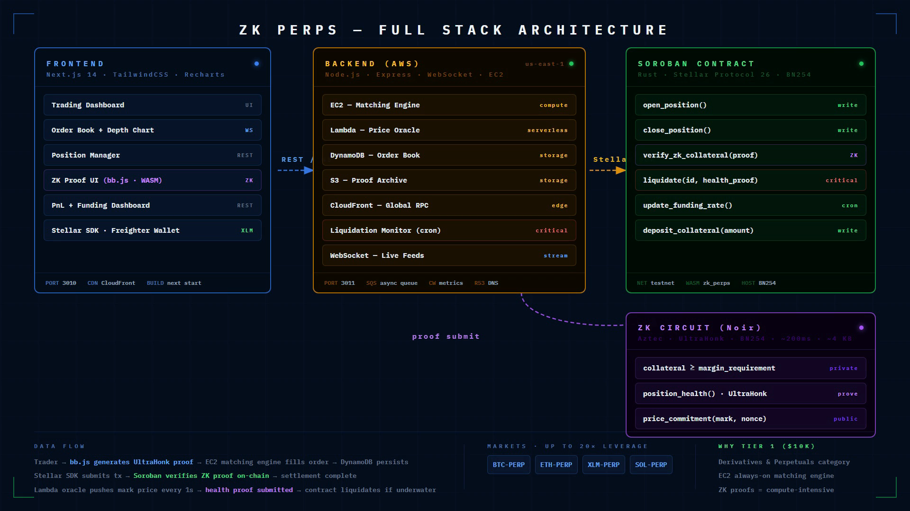
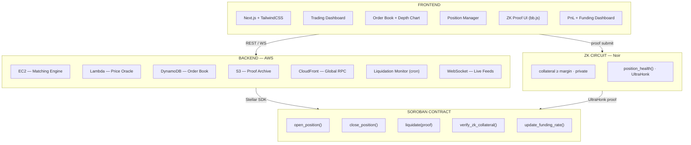

# ZK Perps — Private Perpetuals DEX on Stellar

## Overview

ZK Perps is a decentralized perpetual futures exchange built on the Stellar network that brings institutional-grade privacy to on-chain trading. By combining Soroban smart contracts with zero-knowledge proofs (Noir / UltraHonk), traders can open, manage, and close leveraged positions without revealing their size, direction, or collateral to the public mempool — eliminating front-running and MEV extraction at the protocol level.

The exchange supports four perpetual markets (BTC-PERP, ETH-PERP, XLM-PERP, SOL-PERP) with up to 20x leverage and real-time price feeds sourced from an AWS Lambda oracle pipeline. Order matching runs on a high-throughput AWS EC2 engine, while final settlement and margin accounting are enforced trustlessly on-chain via Soroban. The result is a hybrid architecture that keeps latency competitive with centralized venues while preserving full self-custody and cryptographic privacy.

## Architecture





| Layer | Technology | Purpose |
|---|---|---|
| Frontend | Next.js 14, TailwindCSS, Recharts | Trading UI, position dashboard, PnL charts |
| Matching Engine | Node.js, Express, WebSocket on AWS EC2 | Low-latency order matching and book management |
| Order Book Storage | AWS DynamoDB | Persistent, scalable order book state |
| Price Oracle | AWS Lambda + CloudFront | Aggregated price feeds delivered on a low-latency edge |
| Proof Archive | AWS S3 | Durable storage for submitted ZK proofs |
| Smart Contract | Soroban (Rust), Stellar Protocol 26 | On-chain settlement, margin, and liquidation logic |
| ZK Circuit | Noir, UltraHonk proof system | Private position commitments and proof verification |

## Features

- **Private positions via ZK proofs** — UltraHonk proofs generated client-side with Noir circuits hide position size and direction; only a commitment is posted on-chain.
- **4 perpetual markets** — BTC-PERP, ETH-PERP, XLM-PERP, SOL-PERP with continuous funding rates.
- **Up to 20x leverage** — Margin tiers enforced by the Soroban contract; liquidations are triggered on-chain with no reliance on a centralized keeper.
- **On-chain settlement via Soroban** — All PnL realization, collateral locking, and liquidation logic lives in a Rust smart contract deployed to Stellar Protocol 26.
- **AWS-powered matching engine** — Sub-millisecond order matching on EC2 with WebSocket order flow and DynamoDB-backed book persistence.

## Tech Stack

| Component | Stack |
|---|---|
| Frontend | Next.js 14, TailwindCSS, Recharts |
| Backend | Node.js, Express, WebSocket |
| Smart Contract | Soroban (Rust), Stellar Protocol 26 |
| ZK Circuit | Noir, UltraHonk proof system |
| Cloud | AWS EC2, Lambda, DynamoDB, S3, CloudFront |

## AWS Architecture

```
User Browser
     |
     | WebSocket / REST
     v
[AWS EC2 — Matching Engine]
  Node.js + Express
  In-memory order book  <------>  [AWS DynamoDB]
     |                              (persistent book state)
     | Matched trade
     v
[Soroban Contract — Stellar]
  Settlement / margin / liquidation
     ^
     |  Price feed (HTTPS)
[AWS Lambda — Oracle Aggregator]
     |
[AWS CloudFront — RPC Edge Cache]
     |
[AWS S3 — ZK Proof Archive]
```

The matching engine on EC2 maintains an in-memory order book for maximum throughput and syncs state to DynamoDB for durability and horizontal recovery. When a maker and taker order cross, the engine emits a settlement instruction that is submitted to the Soroban contract. The Lambda oracle aggregates prices from multiple sources on a short interval and publishes signed feed updates; CloudFront caches RPC calls at the edge to reduce Stellar node load. All ZK proofs submitted by traders are archived to S3 for auditability and potential dispute resolution.

## Quick Start

### Prerequisites

- Node.js 18+
- A Stellar testnet keypair (Freighter wallet recommended)

### Frontend

```bash
cd frontend
npm install
npm run dev
# Runs on http://localhost:3010
```

### Backend

```bash
cd backend
npm install
npm run dev
# Runs on http://localhost:3011
```

Configure environment variables by copying `.env.example` to `.env` in each directory and filling in your AWS credentials, Stellar RPC endpoint, and contract address.

## Contract

**Deployed contract address:** `(testnet deployment in progress)`

The Soroban contract source lives in `contracts/zk_perps/src/`. To build and deploy:

```bash
cd contracts
cargo build --target wasm32-unknown-unknown --release
stellar contract deploy --wasm target/wasm32-unknown-unknown/release/zk_perps.wasm --network testnet
```

## Why AWS

Decentralized settlement does not require decentralized infrastructure for every layer. The matching engine demands microsecond-level order processing and stateful book management that cannot be achieved within Soroban's per-transaction execution model today. AWS EC2 provides predictable, low-latency compute that scales with volume. DynamoDB gives the matching engine a durable, highly available backing store without operational overhead. Lambda is the right tool for a stateless oracle aggregator that runs on a tight cron schedule and benefits from edge-optimized invocations via CloudFront. S3 offers cost-effective, infinitely durable storage for the ZK proof archive — proofs can be large (UltraHonk proofs are several kilobytes each), and S3 keeps them accessible for audits without burdening the chain. Together, the AWS services handle the performance-sensitive off-chain work while Soroban enforces the trust-sensitive settlement rules that matter most.
